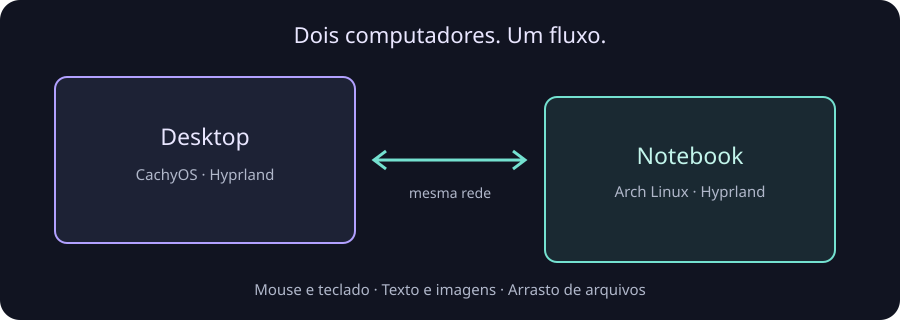

<div align="center">
  
  <h1>Open Desktop</h1>
  <p><strong>Seu mouse atravessa a tela. Seu trabalho continua.</strong></p>
  <p>Compartilhe mouse, teclado e clipboard entre Linux e Mac, com arraste de arquivos entre computadores Linux.</p>
  <p>
    
    
    
    
  </p>
  <p><a href="#instalação">Instalar</a> · <a href="#primeira-conexão">Conectar</a> · <a href="#comandos">Comandos</a> · <a href="#compatibilidade">Compatibilidade</a></p>
  
</div>

<table>
<tr><td width="50%"><h3>↗ Quatro bordas</h3>Empurre o cursor contra uma borda conectada no mapa. Uma barra mostra o progresso até a passagem.</td><td><h3>⌨ Teclado acompanha</h3>Digite e use atalhos no computador que está recebendo o cursor.</td></tr>
<tr><td><h3>▣ Copie aqui, cole lá</h3>Textos e imagens, incluindo capturas de tela, sincronizam entre as máquinas.</td><td><h3>⇄ Arraste arquivos</h3>Entre computadores Linux, leve o arquivo até a outra tela e solte no gerenciador de arquivos.</td></tr>
</table>

## Instalação

[Baixar a release mais recente](https://github.com/matheus-cintra/open-desktop/releases/latest) · [Instalar pelo código](#pelo-código)

### Linux

Nos **computadores Linux**, abra um terminal na sessão Hyprland iniciada com UWSM:

```sh
curl -fsSL https://github.com/matheus-cintra/open-desktop/releases/latest/download/install.sh | sh
```

O daemon é instalado sem `sudo` e sem compilar Rust. O instalador verifica o SHA-256 do pacote, instala em `~/.local/bin`, habilita o início automático e configura a integração do Hyprland. Ao terminar, o instalador abre automaticamente o assistente, que inicia o serviço e orienta o pareamento. Sem terminal interativo, execute `opendesk setup` depois. Adicione `~/.local/bin` ao `PATH` para usar apenas `opendesk`.

Prefere inspecionar o script? Baixe o `install.sh` da release, leia e execute `sh install.sh`. Para uma versão específica: `sh install.sh v0.3.2`.

### macOS / Apple Silicon

Baixe `open-desktop-macos-arm64.zip` e `SHA256SUMS-macos` da
[release 0.3.2](https://github.com/matheus-cintra/open-desktop/releases/tag/v0.3.2).
Na pasta dos downloads, verifique o pacote antes de extrair:

```sh
shasum -a 256 -c SHA256SUMS-macos
```

Feche o app OD e a janela de organização, preserve uma cópia da instalação anterior
e coloque **Open Desktop.app** em `~/Applications`. Abra o app e conceda
Acessibilidade e Monitoramento de Entrada; autorize a rede local se solicitado.
A assinatura é de desenvolvimento e o pacote não é notarizado. Veja
[instalação, permissões e início ao entrar](docs/macos.md).

A partir da **0.3.1**, o Mac suporta atualização pela CLI. A v0.3.0 pública ainda
exige a instalação manual acima para receber o updater. Se `opendesk` não estiver
no PATH, use o executável do bundle:

```sh
"$HOME/Applications/Open Desktop.app/Contents/MacOS/opendesk" update
```

## Primeira conexão

1. Instale a mesma versão em todas as máquinas, conectadas à mesma LAN.
2. Use `opendesk setup` ou **Adicionar computador** na GUI para parear cada par de computadores.
3. No Linux, instale o auxiliar de atividade com `opendesk install-activity` (sudo).
4. Abra `opendesk gui` no Linux ou **OD → Organizar computadores…** no Mac.
5. Arraste os cartões para representar a disposição das telas e clique em **Aplicar**.
6. Empurre o cursor contra uma borda conectada. O teclado acompanha até o próximo destino.

A disposição sincroniza entre as máquinas. Qualquer teclado/mouse físico pode ser a
origem; atividade física em outra máquina assume o controle local. Computadores
bloqueados são pulados quando há um destino elegível na mesma direção.
**Ctrl+Alt+Esc** libera o controle imediatamente. Fechar a janela do mapa mantém o
compartilhamento ativo. O clipboard sincroniza mesmo quando o cursor está local.

## Comandos

| Quero… | Comando |
|---|---|
| Organizar computadores | `opendesk gui` |
| Instalar auxiliar de atividade física (Linux, sudo) | `opendesk install-activity` |
| Configurar ou parear | `opendesk setup` |
| Ver conexão, endereço e bordas | `opendesk status` |
| Encontrar computadores | `opendesk discover` |
| Pausar / retomar passagens | `opendesk pause` / `opendesk resume` |
| Recuperar o controle local | `opendesk release` |
| Iniciar / parar / reiniciar | `opendesk start` / `stop` / `restart` |
| Diagnosticar | `opendesk doctor` |
| Acompanhar logs | `opendesk logs` — Ctrl+C fecha os logs |
| Atualizar | `opendesk update` |
| Escolher uma versão | `opendesk update v0.3.2` |
| Desinstalar, preservando dados | `opendesk uninstall` |

Pausar impede novas passagens; não desliga a sincronização do clipboard. Use `stop` para desligar o serviço inteiro. `enable` e `disable` continuam disponíveis como aliases de `resume` e `pause`.

<details>
<summary>Pareamento e modo legado de bordas (antes de aplicar um mapa)</summary>

```sh
opendesk pair NOME
# Leia o PIN usando opendesk status no outro computador.
opendesk peer set NOME --side all
opendesk peer set NOME --side left
opendesk peer remove NOME
```

Também são aceitos `right`, `top`, `bottom` e a sintaxe anterior `peer set NOME left`. Um peer com `all` não pode disputar bordas com outro peer. Configure a posição em cada computador.
</details>

## Compatibilidade

| Suporte inicial | Escopo |
|---|---|
| Sistema | Arch Linux e CachyOS x86_64; Apple Silicon/macOS 26 experimental |
| Sessão Linux testada | Hyprland **0.56.2**, configuração **Lua**, gerenciada pelo **UWSM** |
| Telas | Três computadores validados, uma tela ativa por computador |
| Rede | Mesma LAN confiável; TCP/UDP **47820**, mDNS UDP **5353** |
| Clipboard | Texto e imagens |
| Arquivos | Arraste Linux ↔ Linux; sem Finder DnD ou terceiro computador |

**O transporte ainda não é criptografado. Use somente em rede local confiável.** O PIN pareia os dispositivos; não fornece criptografia do tráfego. Execute a mesma versão em todas as máquinas. O protocolo atual é 4; versões de protocolo incompatíveis são rejeitadas.

Não há suporte anunciado para outros compositores, configuração Hyprland antiga em `.conf`, múltiplos monitores por máquina, Windows. O suporte macOS é experimental, conforme descrito na instalação. O instalador não altera o firewall automaticamente. Se a descoberta falhar, confira as portas acima e o isolamento de clientes do Wi-Fi.

## Atualização e remoção

No Linux e no Mac com a versão 0.3.1 ou posterior:

```sh
opendesk update          # release mais recente
opendesk update latest
opendesk update v0.3.2   # versão explícita; permite reinstalar
opendesk uninstall
```

No **Linux**, a atualização substitui o binário de forma atômica e reinicia o serviço
se ele estava ativo. Falhas na instalação restauram os arquivos substituídos e o
estado anterior do serviço. Configuração, identidade e pareamento são preservados.

No **Mac**, o updater verifica checksum, versão, bundle ARM64 e a mesma identidade
de assinatura antes de fechar o app. Ele cria backup do app e dos dados, reabre a
janela de organização se estava aberta e confirma o processo instalado e a resposta
IPC. Falhas acionam a restauração; interrupções deixam um registro para recuperação
na próxima execução. Permissões não são resetadas. **Aplique as edições do mapa
antes de atualizar: alterações ainda não aplicadas não são salvas.**

O updater Mac usa `/usr/bin/python3`, fornecido pelas Command Line Tools da Apple,
e não precisa de checkout do projeto. Recusa mudança de certificado. Uma volta à
v0.3.0 pública também remove o updater, exigindo instalação manual para retornar à
0.3.1. Consulte [uso e recuperação no Mac](docs/macos.md#update-and-recovery).

| Dados e backups | Linux | macOS |
|---|---|---|
| Configuração, identidade, pares e mapa | `~/.config/opendesk` ou diretório XDG configurado | `~/Library/Application Support/opendesk` |
| Backups | `~/.local/share/opendesk/backups` ou diretório XDG configurado | `~/Library/Application Support/Open Desktop/backups/update.*` |

A desinstalação preserva os dados. No Mac, feche a janela de organização e desative
**Iniciar ao entrar** antes de remover o app; o comando remove o bundle, mas não limpa o link da CLI nem o registro
de início de sessão. Os backups são mantidos e contêm dados de pareamento; não os
apague enquanto precisar de recuperação. Nunca copie identidades entre computadores.
Depois de reinstalar, `setup` permite selecionar o peer existente.

## Pelo código

### Linux

Requer Rust **1.98**, compilador C, `pkgconf`, Wayland e libxkbcommon:

```sh
cargo build --release --locked
./target/release/opendesk install
~/.local/bin/opendesk setup
```

### macOS / Apple Silicon

Requer Rust **1.98** e as Command Line Tools da Apple. No Mac:

```sh
export PATH="$HOME/.cargo/bin:$PATH"
bash scripts/build-macos.sh
bash scripts/install-macos.sh
```

Na primeira compilação, o script pode pedir a autorização do certificado local;
siga [o procedimento de assinatura](docs/macos.md#build-and-install) e repita o build.
O instalador local utiliza o mesmo fluxo de backup e restauração do updater.

## Atividade física no Linux

O auxiliar Linux requer sudo para instalar um serviço dedicado:

```sh
opendesk install-activity
# Para remover:
opendesk uninstall-activity
```

Ele publica somente notificações de atividade física, sem teclas ou texto, e não
adiciona seu usuário ao grupo input. O Mac utiliza a integração nativa do app.

Identidades e pareamentos são preservados. O protocolo 4 é incompatível com protocolos
anteriores; use versões compatíveis em todos os computadores. Consulte as
[notas e pendências de validação da 0.3.1](docs/release-0.3.1.md).

## Desenvolvimento

[Arquitetura e testes](docs/technical.md) · [Processo de release](docs/releases.md)

Mouse, quatro bordas, teclado, clipboard de texto/imagens, arrasto e liberação de emergência foram validados fisicamente no par CachyOS/Arch. A atualização da 0.3.1 foi verificada nos três computadores, com artefatos, assinatura, dados, processos e IPC; a confirmação física específica de GUI, permissões e controle após essa atualização continua pendente. Testes de CI não substituem a validação nas sessões reais.

Distribuído sob **MIT ou Apache-2.0**, à sua escolha.

### Tela bloqueada

No modo de mapa, uma máquina bloqueada não recebe controle. Se houver outra tela
elegível alinhada na direção da saída, a máquina bloqueada é pulada. Bloquear a
origem ou o destino durante controle remoto libera a sessão. Desbloquear não
desfaz `pause`. O modo legado por bordas permanece disponível antes de aplicar
um mapa; seu comportamento é diferente e não deve ser usado para representar o mapa.
